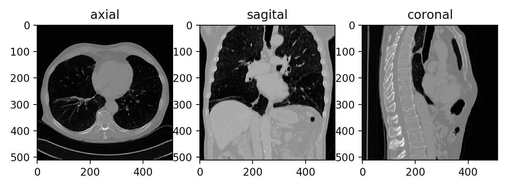
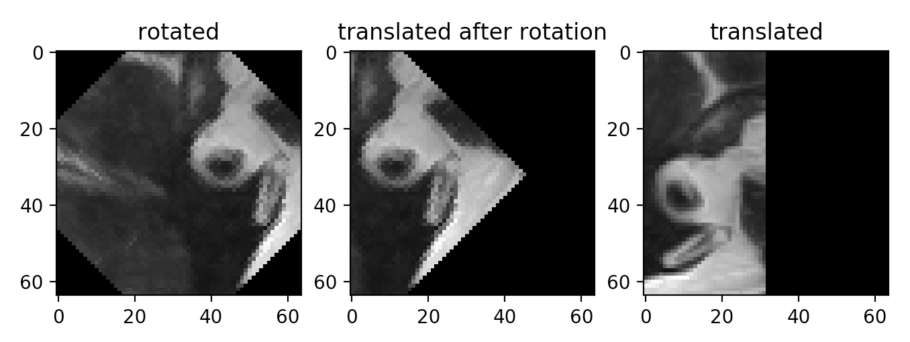
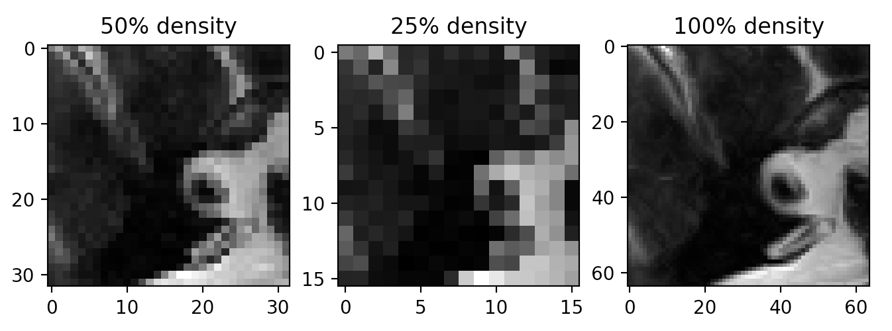

About
========

**dicom3d** is a comprehensive Python package for reconstructing arbitrary defined 3D sections 
from volumetric medical scans (CTs or RMNs), scale accurate and with a builtin pixel-to-world 
coordinate mapping system.

It comes preloaded with the necessary mathematical backend to manipulate space information from 
medical scans, and provides a mapping system that can transparently handle different imaging 
properties such as pixel density, dataset thickness, patient orientation, patient positioning, 
etc.

Dependencies
------------
It relies on **pydicom** for loading DICOM medical images and **numpy** for array manipulation.

Installation
------------

From PyPi package repository:

    pip install dicom3d

Quick start
-----------

A quick way of understanding **dicom3d** is to explore its built-in examples.

To run them, execute the **dicom3d.examples** utility after installing the package:

```
$ python3 -m dicom3d.examples
[ 1] - dicomdir/loading.py
[ 2] - section/planar.py
[ 3] - section/basic.py
[ 4] - section/translation.py
[ 5] - section/make_gif.py
[ 6] - section/rotation.py
[ 7] - geometry/vectors.py
[ 8] - geometry/planes.py
[ 9] - geometry/basic.py
Select example [1-9]:
```

Some of the examples will require a volumetric scan to work with, stored in a folder with 
multiple *.DCM* files. You can download many free CT or RMN scans from 
[canerimagingarchive.net](https://nbia.cancerimagingarchive.net)

When you have them, navigate to the folder you downloaded them and run **dicom3d.examples** 
utility. The utility will look for those scans starting from the current working directory.

For example, to run the **basic.py** from **dicom3d**:

```
>$ cd dicom_data/test_files
>$ python3 -m dicom3d.examples section/basic.py

===-----------------------------------------------------===
 |                   BASIC SECTIONS                      |
===-----------------------------------------------------===

    This example shows how to create basic sections from
    a volumetric scan.

    It will create the sagittal, axial and coronal medical
    sections form the selected volumetric scan.

    The volumetric scan must a folder of .DCM files located
    in the current working directory.

    Each section image is plotted using matplotlib.

===-----------------------------------------------------===

Select a folder containing a list of '.dcm' files:
[ 1] - dicomdir_1
[ 2] - series_ct_lung_3
[ 3] - series_ct_lung_2
[ 4] - series_ct_heart_1
[ 5] - series_brain_1
[ 6] - series_ct_heart_2
[ 7] - series_ct_lung_1
[ 8] - series_brain_2
Select series [1-8]:
```

After selecting one series, the example will slice the volumetric scan and plot the 
resulted *axial*, *sagittal* and *coronal* sections.

```
Loading series from:  series_ct_lung_2
---
Origin: X:-9.65 Y:-158.65 Z:260.00
Axial    plane: 0.00X + 0.00Y + 1.00Z = 260.00 DPI: 17.86
Coronal  plane: 1.00X + 0.00Y + 0.00Z = -9.65
Sagittal plane: 0.00X + 1.00Y + 0.00Z = -158.65
---
Creating axial image..done.
Creating sagittal image..done.
Creating coronal image..done.
---
Plotting..
```



Basics
------

let's now see how the **basic.py** example is built, step by step.

Using **dicom3d** does not require a heavy prior-art in geometry. For defining sections, 
you need to work with planes, vectors, and three-dimensional coordinates, but **dicom3d** 
can help you build those relatively to existing geometry.

### Defining a plane

First, let's define section planes:

```python
axial    = d3d.Plane.from_axes("xy")
coronal  = d3d.Plane.from_axes("xz")
sagittal = d3d.Plane.from_axes("yz")
```

We start from the basic **OXY**, **OXZ** and **OYZ** planes. These are the planes parallel to 
the medical *axial*, *coronal* and *sagittal* section planes respectively. They describe the 
bottom, left and front planes of the volumetric scan. To become the medical planes their name 
suggests, we need to translate them to the center of the volumetric scan. 

Simplest way to get the scan's center point is:

```python
middle_dataset = series.middle()
origin = middle_dataset.center()

# this will not print a tuple as excepted, but
# it will print the string representation of
# dicom3d.geometry.Point object
print("Origin is: %s" % (origin))
```

This code gets the dataset in the middle of the scan's Z segment and then its corresponding 
geometric center in world coordinates.

And now, to make the translation:

```python
# note: no operation on planes, vectors or points
# will alter the source object, rather it will create a copy 
axial    = axial.move(origin)
coronal  = coronal.move(origin)
sagittal = coronal.move(origin)

print("Axial: %s Coronal: %s Sagittal: %s" % (axial, coronal sagittal))
```

According to the DICOM standard, these are now the mathematical plane definitions for the 
corresponding medical planes *axial*, *sagittal* and *coronal*.

### Constructing a section

The last step is to build the actual section. For this, we need a point to work as a center 
and a plane. The sliced section will be reconstructed around this point. For example, a 
section of 128x128 pixels will extend from (-64,-64) to (64,64) in the local coordinate 
system, with the point (0,0) mapped to the given origin, in world coordinates.

```python
section_axial    = d3d.Section.from_plane(series, axial   , origin)
section_coronal  = d3d.Section.from_plane(series, coronal , origin)
section_sagittal = d3d.Section.from_plane(series, sagittal, origin)
```

### Wrap-up

Putting it all together, we should end up with this:

```python
from dicom3d.data import select_file
import dicom3d as d3d

def select_series_path():
    print("Select a folder containing a list of '.dcm' files:")
    return select_file(
		base_dir = os.path.abspath('.'), 
		pattern = "*",
		search_files = False,
		search_dirs = True,
		selection_name = "series" )

# retrieve a series sample, asuming your CT/RMN scans 
# are located in the current working directory
path   = select_series_path()
series = d3d.series.from_directory(path)

# get scan center
origin = series.middle().center()

# build medical sections
axial    = d3d.Plane.from_axes("xy").move(origin)
coronal  = d3d.Plane.from_axes("xz").move(origin)
sagittal = d3d.Plane.from_axes("yz").move(origin)

# construct sections
section_axial    = d3d.Section.from_plane(series, axial   , origin)
section_coronal  = d3d.Section.from_plane(series, coronal , origin)
section_sagittal = d3d.Section.from_plane(series, sagittal, origin)

# size of the resulting image will be 256 by 256 pixels
size = (256,256)
img_axial    = section_axial.image(size)
img_coronal  = section_coronal.image(size)
img_sagittal = section_sagittal.image(size)
```

That's it! We can now plot the **numpy** images using **matplotlib**.

### Dimensions

Defining the size of a section in pixels has the disadvantage of not being "portable" across
different DICOM datasets, if their *PixelSpacing* varies from one to another. 

For example, a section with 100x100 pixels can map to 100x100 millimeters if the DICOM has the 
*PixelSpacing* attribute set to (1,1). The same size can translate to 50x50 millimeters if the 
*PixelSpacing* attribute is (0.5, 0.5), half the previous.  

To handle this, **dicom3d** will calculate the distance in millimeters and convert it to pixels, 
when you want to construct section images.

To do that, you just need to pass *floats* instead of *integers*:

```python
# this image will be 30 mm in width and 200 mm in height
size = (30.0, 200.0)
img_coronal = section_coronal.image(size)
```

Local Coordinate System
------------------------

**dicom3d** attaches to each dataset, a **dicom3d.LocalCoordinateSystem** object for 
mapping pixel information, from the cartesian/local space (x,y), to world cooridnates measured 
in millimeters. Sections created via **dicom3d** have the same mapping feature, therefore to know 
where local point (-10,-10) lies in world coordinates, you could use:

```python
# transform the given local point, in respect 
# to section's origin, to world coordinates
x,y,z = section_coronal.to_mm(-10,-10)

# we should get back the local point -10,-10
x,y = section_coronal.to_local((x,y,z))
```

Same for datasets:

```python
# get a 'random' dataset
dataset = series.first()

# transfrom local to world and viceversa
x,y,z = dataset.to_mm(-10,-10)
x,y = dataset.to_local((x,y,z))
```

### Rotation, translation and scaling

The **dicom3d.LocalCoordinateSystem** has built-in support for these operations, therefore to 
rotate the LCS around a given axis, you can write:

```python
    # rotate the LCS around Z axis by 30 degrees
    section.transform = \
        section.transform.rotate("z", d3d.radians(30))
```

Or to translate it on a given axis:

```python
    # move LCS on the Z axis by 100
    section.transform = section.transform.move(
        d3d.Vector.from_axis("z"), 100.0)
```

To modify its scaling factor:

```python
    # the scaling factor is divided by 2
    section.transform = section.transform.scale(0.5)
```

Direct alteration of a *Local Coordinate System* is also possible, if needed. The only requirement 
is to call its **update** function after modifying internal parameters, to calculate the internal 
transformation matrix.

```python
    # swap X and Y axis
    x_axis = section.transform.x_vector
    section.transform.x_vector = section.transform.y_vector
    section.transform_y_vector = x_axis
    section.transform.update() 
```

Planar datasets
---------------

If you are not interested in building sections for volumetric 3D scans and you work only with 
planar DICOM datasets, you can still use **dicom3d** for its mapping system of pixel to world 
coordinates or for creating translated, rotated or scaled planar sections.

For taking measurements using the cartesian mapping, you can use a pseudo-series of **dicom3d** 
datasets, as follows:

```python
    import dicom3d as d3d
    import pydicom
    from pydicom.data import get_testdata_files

    def getMyDataset():
        files = get_testdata_files("MR_small_bigendian.dcm")
        print("Loading dataset from: ", files[0])
        return pydicom.dcmread(files[0])
        
    # assuming you have a function returning sa pydicom dataset
    dataset = getMyDataset()

	# construct a section from a single dataset
	planar_section = d3d.Section.from_dataset(dataset)

	# get wrapped dicom3d.Dataset class
	dataset = planar_section.series.first()
	origin = dataset.center()

    # navigate through dataset
    x,y,z = dataset.to_mm(0,0)
    print("Pixel at (0,0) is at X:%.2f Y:%.2f Z:%.2f" % (
        x,y,z))

    x,y,z = dataset.to_mm(dataset.Columns,dataset.Rows)
    print("Pixel at (%d,%d) is at X:%.2f Y:%.2f Z:%.2f" % (
        dataset.Columns, dataset.Rows, x,y,z))
```

And now you may get the corresponding numpy image of the section:

```python
    # extract an image of 96x96 pixels containing dataset center
    width, height = 96, 96
    img = planar_section.image((width,height))
```

Now that we have a **dicom3d.Section** for the planar dataset that we can use it to produce
an image, rotated, translated or scaled or to use its coordinating system to map pixels
to world coordinates, like this:

```python
    # top left and bottom right pixel coordinates
    topleft = planar_section.to_mm(-width/2, -height/2)
    btmright = planar_section.to_mm(width/2, height/2)

    # center coordinates
    center = planar_section.to_mm(0,0)

    # because datasets are parallel to OXY, we can ignore the Z coordinate
    xs,ys,_ = topleft
    xe,ye,_ = topright
    ox,oy,oz = center

    print("The %d x %d pixels section it's %.2fmm x %.2fmm in size" % (
        width, height,
        abs(xe-xs), abs(ye-ys)
    ))

    print("Center of section is at X:%.2f Y:%.2f Z:%.2f" % (
        ox, oy, oz
    ))
```

If you want to run this example, run:

    python3 -m dicom3d.examples section/planar.py

And you will should see the following images plotted:



For the scaled sections: 



Roadmap
=======
Features we expect to develop in the near future for **dicom3d**:
- [ ] performance improvement for section reconstruction
- [ ] depth-information for sections
- [ ] a set of predefined, configurable image filters for segmenting information after creating a section
- [ ] overlaying information over reconstructed sections 

License
=======
Licence for this Python package is the **MIT License** under **Copyright (c) 2020 Bitdefender**.

Author
======
This library was developed by *Alex Mircescu* (`amircescu`@`bitdefender.com`) for an experimental 
machine learning application conducted by *Florin Gogianu* (`fgogianu`@`bitdefender.com`).